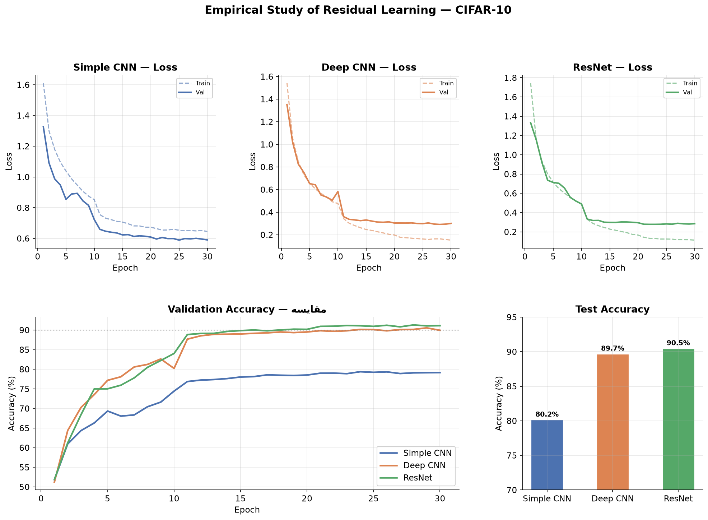
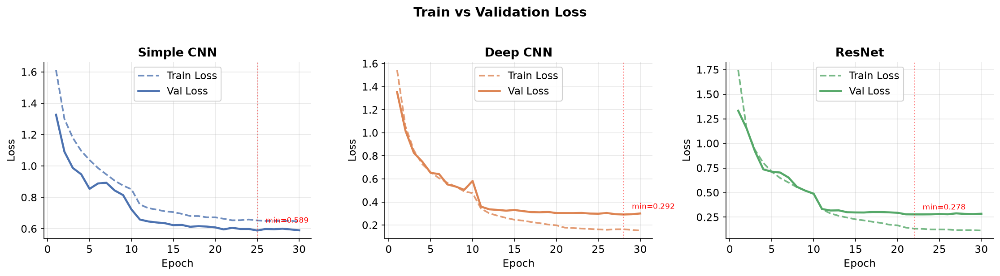
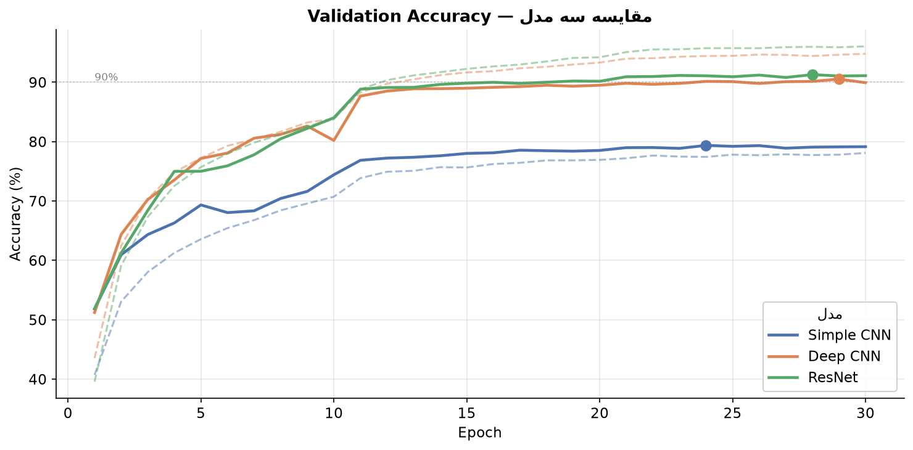
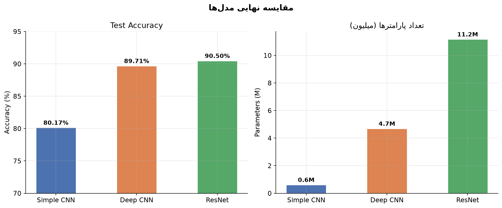

# Empirical Study of Residual Learning in Deep Networks

> A hands-on comparison of SimpleCNN, DeepCNN, and ResNet on CIFAR-10 — exploring how residual connections solve the vanishing gradient problem.



---

## 📌 Motivation

When neural networks get deeper, they paradoxically become harder to train. Gradients shrink as they travel backward through many layers, causing early layers to learn almost nothing — the **vanishing gradient problem**.

He et al. (2015) proposed a simple but powerful fix: instead of learning `H(x)` directly, let the network learn the **residual** `F(x) = H(x) - x`, so the output becomes `F(x) + x`. This shortcut connection guarantees a direct gradient path back to early layers.

This project empirically verifies this claim by training three architectures under identical conditions and comparing their learning dynamics.

---

## 🏗 Models

| Model | Layers | Parameters | Test Accuracy |
|---|---|---|---|
| **Simple CNN** | 3 Conv | 620K | 80.17% |
| **Deep CNN** | 8 Conv (no skip) | 4.7M | 89.71% |
| **ResNet** | 8 Conv + skip connections | 11.2M | **90.50%** |

All models trained for 30 epochs on CIFAR-10 with identical hyperparameters (Adam, lr=0.001, weight decay=1e-4).

---

## 📊 Results

### Loss Curves


### Validation Accuracy


### Final Comparison


---

## 🔍 Key Findings

- **ResNet vs DeepCNN**: Only ~0.8% accuracy gap despite having 2.4x more parameters. The real advantage of residual connections shows in *training stability* — ResNet converges smoother and faster.
- **DeepCNN surprise**: BatchNorm helped DeepCNN train reasonably well (+9% over SimpleCNN), but ResNet still wins on both accuracy and convergence speed.
- **SimpleCNN**: Proves that depth matters — 10x fewer parameters leads to ~10% accuracy drop.

---

## 🚀 Quickstart

### 1. Clone & install

```bash
git clone https://github.com/YOUR_USERNAME/resnet-empirical-analysis.git
cd resnet-empirical-analysis
python -m venv venv
source venv/bin/activate      # Windows: venv\Scripts\activate
pip install -r requirements.txt
```

### 2. Train all models

```bash
python train.py --epochs 30
```

Train a single model:
```bash
python train.py --model resnet --epochs 30
```

### 3. Plot results

```bash
python plots.py
```

### 4. Launch demo

```bash
python app/gradio_app.py
```

---

## 📁 Project Structure

```
resnet-empirical-analysis/
│
├── src/
│   ├── datasets/
│   │   └── cifar10.py          # CIFAR-10 DataLoader + augmentation
│   ├── models/
│   │   ├── simple_cnn.py       # 3-layer CNN baseline
│   │   ├── deep_cnn.py         # 8-layer CNN without skip connections
│   │   └── resnet.py           # ResNet with residual blocks
│   └── training/
│       └── trainer.py          # Generic training loop
│
├── app/
│   └── gradio_app.py           # Interactive demo
│
├── outputs/
│   ├── figures/                # Generated plots
│   └── checkpoints/            # Saved model weights (not tracked)
│
├── train.py                    # Main training script
├── plots.py                    # Visualization script
└── requirements.txt
```

---

## 🛠 Tech Stack

- **PyTorch** — model building & training
- **torchvision** — CIFAR-10 dataset & transforms
- **Matplotlib** — result visualization
- **Gradio** — interactive demo
- **CUDA** — GPU acceleration

---

## 📖 Reference

He, K., Zhang, X., Ren, S., & Sun, J. (2015).
[Deep Residual Learning for Image Recognition](https://arxiv.org/abs/1512.03385).
*arXiv:1512.03385*

---
